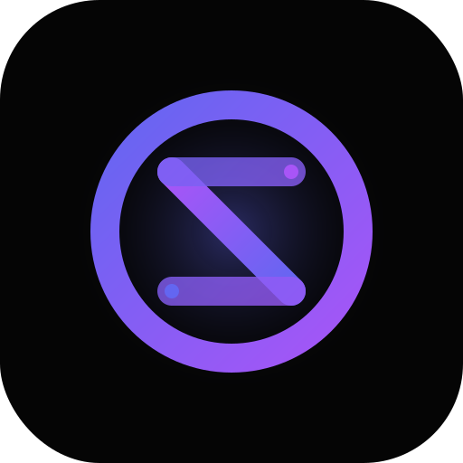

<div align="center">
  
  <h1>Zero</h1>
  <p align="center">
    <strong>Sub-millisecond Markdown precision. Engineered for developer.</strong>
  </p>
  <p align="center">
    
    
    
    
  </p>
</div>

---

## Performance as a Priority

Zero is a high-performance native Markdown editor for macOS, built with **Tauri v2** and **React 19**. It follows the industry-standard philosophy of tools like **Sublime Text** and **Notion**: respecting the user's filesystem while providing a fluid, ethereal writing experience.

### Key Features

- **Bare-Metal Speed**: Native Rust core ensures zero lag, even with massive documents.
- **Minimalist Aesthetics**: Glassmorphic UI that blends seamlessly into the macOS ecosystem.
- **Filesystem Respect**: Defaults to your Home directory (`~`). No hidden folders, no forced structures.
- **Neural-Fuzzy Search**: Sub-millisecond file switching with `⌘ K`.
- **Advanced Preview**: Real-time side-by-side rendering with full GFM, Mermaid, and PlantUML support.
- **Enterprise Quality**: Built-in CI/CD with rigorous linting, type-checking, and security auditing.

---

## Installation

Zero is distributed via the Homebrew package manager.

```bash
brew tap kanywst/tap
brew install zero
```

### Development Setup

```bash
# Clone the repository
git clone https://github.com/kanywst/zero

# Enter the workspace
cd zero

# Install & Run
npm install
npm run tauri dev
```

---

## Shortcuts

| Action       | Shortcut |
| :----------- | :------- |
| **save**     | `⌘ s`    |
| **search**   | `⌘ k`    |
| **preview**  | `⌘ a`    |
| **split**    | `⌘ d`    |
| **sidebar**  | `⌘ b`    |
| **new file** | `⌘ n`    |

---

<div align="center">
  <p>© 2026 Zero Project. Released under the MIT License.</p>
</div>
